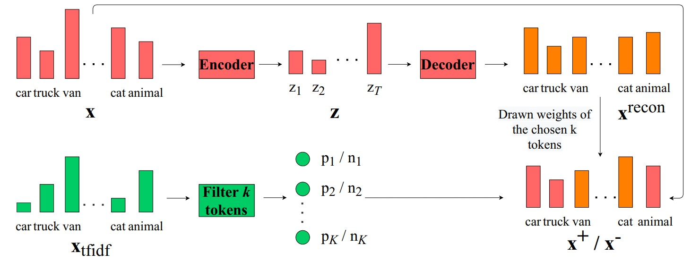

# Contrastive Learning for Neural Topic Model
This repository contains the implementation of the paper [Contrastive Learning for Neural Topic Model](https://arxiv.org/abs/2110.12764).

[Thong Nguyen](https://nguyentthong.github.io/), [Luu Anh Tuan](https://tuanluu.github.io/) (NeurIPS 2021)


In this work, we target the problem of capturing meaningful representations through modeling the relations among samples from a mathematical perspective and propose a novel contrastive objective to train the neural topic model, along with the optimization of the variational lower bound. In our contrastive learning framework, we introduce a novel sampling strategy that is motivated by human behavior when comparing numerous documents. Our results show that capturing mutual information between the prototype and its positive sample provides a strong foundation for constructing coherent topics, while differentiating the prototype from the negative samples plays a less fundamental role.

```
@inproceedings{
nguyen2021contrastive,
title={Contrastive Learning for Neural Topic Model},
author={Thong Thanh Nguyen and Anh Tuan Luu},
booktitle={Advances in Neural Information Processing Systems},
editor={A. Beygelzimer and Y. Dauphin and P. Liang and J. Wortman Vaughan},
year={2021},
url={https://openreview.net/forum?id=NEgqO9yB7e}
}
```

## Requirements
- python3
- pandas
- gensim
- numpy
- torchvision
- pytorch 1.7.0
- scipy

## How to Run
1. Download and put the dataset in the ```data``` folder: [https://bit.ly/44mUEUv](https://bit.ly/44mUEUv)
2. Train the model by running ```./scripts/train_models/run_{dataset}_{topk}.sh```
3. Evaluate the model via executing ```./scripts/evaluate/run_{dataset}_npmi_{topk}.sh```

## Acknowledgement
Our implementation is based on the official code of [SCHOLAR](https://github.com/dallascard/scholar).
